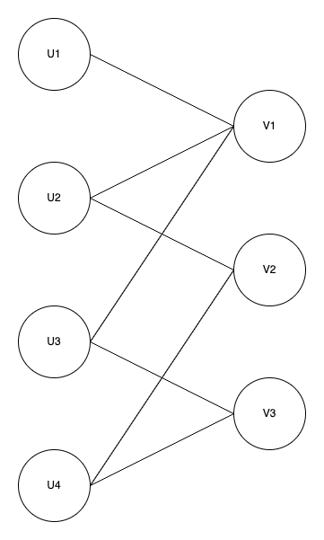

# Matching
[Bipartite graph](https://en.wikipedia.org/wiki/Bipartite_graph) maximum matching algorithm implemented in Java. Treats the problem as a network flow problem and uses 
highly performant [push-relabel maximum flow algorithm](https://en.wikipedia.org/wiki/Push%E2%80%93relabel_maximum_flow_algorithm).

## Quick start

```xml
<dependency>
    <groupId>org.open-structures</groupId>
    <artifactId>matching</artifactId>
    <version>1.2.2</version>
</dependency>
```

Let's say our problem looks like this:



The edge between nodes means that they can be matched. A set of matches where the maximum set of nodes is matched could look like this:


or like this: 


There could be many options.

---

Here's how it can be expressed in code. First we define a 'task qualifications' predicate – a function that returns true when a person can do a task:

    BiPredicate<String, String> matchingPredicate = (u, v) ->
                (u.equals("U1") && v.equals("V1")) ||
                        (u.equals("U2") && (v.equals("V1") || v.equals("V2"))) ||
                        (u.equals("U3") && (v.equals("V1") || v.equals("V3"))) ||
                        (u.equals("U4") && (v.equals("V2") || v.equals("V3")));


Next we create new `Matching` and find a maximum matching:

    Matching<String, String> matching = Matching.newMatching(matchingPredicate, Set.of("U1", "U2", "U3", "U4"), Set.of("V1", "V2", "V3"));
    matching.findMatching();
    System.out.print(matching.getMatches()); // could print {U2={V1=1}, U4={V2=1}, U3={V3=1}} or any other of maxumim matches

### Setting count of elements in V

Sometimes it's convenient to be able to set count of elements in V.  
For example, let's say that U represents people and V represents job roles. 
Some of those roles might require several people for the team to be complete. 
In such cases if two people are qualified for the role, and it requires more than one person, then both people could be matched to the same role.

    Matching<String, String> matching = Matching.newMatching(qualificationsPredicate, Set.of("Person1", "Person2", "Person3"), Map.of("Role1", 2, "Role2", 1));
    matching.findMatching();
    System.out.print(matching.getMatches()); // {Person3={Role2=1}, Person1={Role1=1}, Person2={Role1=1}}

In this example the Role1 requires two people and Role2 – one person. The first two people qualify for both roles. Person3 can only be assigned to Role2.
